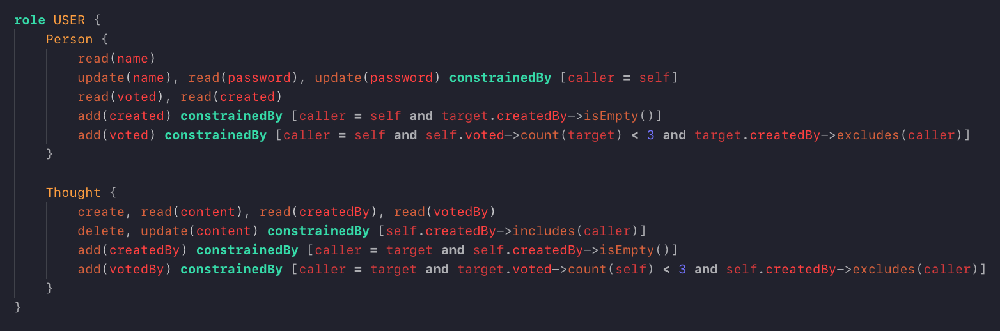

# simple-actiongui

This is a VS Code extension that adds syntax highlighting support for [ActionGUI](http://actiongui.inf.ethz.ch) (.dtm, .stm, .gtm) files.

## Features

- Syntax highlighting for ActionGUI! Not guaranteed to match the spec exactly, but it's been close enough so far, and I'm adding to it as I learn more. It's certainly better than nothing.
- This includes embedded OCL in both security and GUI models.

## Known Issues

I wrote this grammar based on my practical work with ActionGUI before seeing there was an official grammar on the site. I'm sure there's a bunch of parts missing, and I'll happily add support for any you find and report.

## Release Notes

Not released yet.
